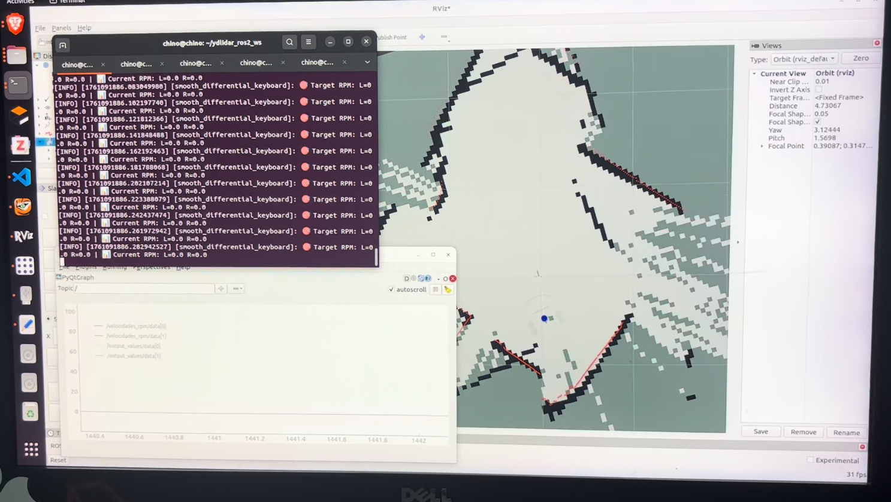

# Bobert — robot diferencial para pruebas de navegación (Lyapunov)

Espacio de trabajo ROS 2 con la descripción, simulación y navegación de **Bobert**, un robot móvil diferencial. El objetivo de este repositorio es probar un controlador de navegación propio, basado en un teorema de estabilidad de Lyapunov, sobre un modelo simulado. No es un producto ni un robot de asistencia terminado: es un banco de pruebas personal de control y navegación.

<!--
  TODO: agrega aquí una imagen de portada del robot (foto, render o captura de Gazebo).
  Guarda el archivo en docs/images/ y descomenta la línea de abajo.
-->
  

## Contenido

- [Descripción general](#descripción-general)
- [Estructura del repositorio](#estructura-del-repositorio)
- [Requisitos](#requisitos)
- [Instalación y compilación](#instalación-y-compilación)
- [Uso](#uso)
  - [1. Visualizar el robot](#1-visualizar-el-robot-sin-simulación-física)
  - [2. Simulación en Gazebo + SLAM](#2-simulación-en-gazebo--slam)
  - [3. Control manual y por waypoints (Lyapunov)](#3-control-manual-y-por-waypoints-lyapunov)
  - [4. Navegación con Nav2 (por comandos)](#4-navegación-con-nav2-por-comandos)
- [Galería](#galería)
- [Notas y pendientes conocidos](#notas-y-pendientes-conocidos)

## Descripción general

Bobert es un robot diferencial simulado en **ROS 2 Humble** + **Gazebo Classic 11**. El proyecto incluye:

- **Descripción del robot** (URDF/Xacro, mallas 3D, `robot_state_publisher`).
- **Simulación** en Gazebo con un mundo de interior (`oficce_small.world`).
- **Mapeo (SLAM)** con `slam_toolbox`.
- **Navegación autónoma** con **Nav2** (map server, AMCL, planificación y evitación de obstáculos), operada actualmente **por comandos manuales** (aún no está integrada en un único `launch`).
- **Controlador de navegación propio** (`publicar_cmd/navegation_control.py`): dado un punto objetivo `(xd, yd)` y la pose actual del robot (odometría de ruedas), calcula distancia y error angular al objetivo y genera `v`/`w` con una ley de control basada en un teorema de estabilidad de Lyapunov para robots tipo unicycle/diferencial, con un perfil de velocidad suavizado por waypoint.

<!-- TODO: agrega aquí un GIF o imagen del robot navegando de forma autónoma -->
<!--  -->

## Estructura del repositorio

```
src/
├── robot_description/         # Paquete principal: URDF, mundo de Gazebo, mapas, config de SLAM y launch files
│   ├── urdf/                  # Bobert.urdf, Bobertaux.urdf, beberto_visualizar.urdf
│   ├── worlds/                 # oficce_small.world, tugbot_depot.sdf
│   ├── maps/                   # map.yaml/.pgm, parkin_simulation.yaml/.pgm
│   ├── config/                 # mapper_params_online_async.yaml (slam_toolbox)
│   └── launch/                 # display.launch.py, gazebo.launch.py
├── Bobert_description/        # Paquete alterno de descripción (Xacro + Gazebo Sim/ros_gz), usado para pruebas de visualización
├── publicar_cmd/               # Nodos propios: publicar_vel, leer_Odom, control (navegación por Lyapunov)
└── gazebo_models_worlds_collection/  # Colección de modelos/mundos de Gazebo de terceros (vendored)
```

## Requisitos

- Ubuntu 22.04
- ROS 2 Humble
- Gazebo Classic 11 (`gazebo_ros`)
- [Nav2](https://docs.nav2.org/) (`navigation2`, `nav2_bringup`, `nav2_map_server`, `nav2_amcl`, `nav2_util`)
- `slam_toolbox`
- Python 3, `colcon`

## Instalación y compilación

```bash
cd ~/roam_ws
colcon build --symlink-install
source install/setup.bash
```

## Uso

### 1. Visualizar el robot (sin simulación física)

```bash
ros2 launch robot_description display.launch.py
```

Abre RViz con `robot_state_publisher` y `joint_state_publisher` (o su versión GUI con `gui:=true`).

### 2. Simulación en Gazebo + SLAM

```bash
ros2 launch robot_description gazebo.launch.py
```

Este único `launch` levanta: `robot_state_publisher`, Gazebo (con el mundo `oficce_small.world`, incluido a través del `launch` propio de `gazebo_ros` para que las mallas del URDF se resuelvan bien), RViz, el spawn del robot y **`slam_toolbox`** (con `config/mapper_params_online_async.yaml`). No es necesario lanzar estos nodos por separado.

### 3. Control manual y por waypoints (Lyapunov)

Nodos del paquete `publicar_cmd`:

```bash
ros2 run publicar_cmd publicar_vel   # publica una velocidad lineal constante en /cmd_vel
ros2 run publicar_cmd leer_Odom      # escucha /wheel/odometry y lo imprime en consola
ros2 run publicar_cmd control        # navegación por waypoints con el controlador de Lyapunov (usa /wheel/odometry -> /cmd_vel)
```

Los waypoints del controlador (`control`) se editan directamente en `src/publicar_cmd/publicar_cmd/navegation_control.py`.

### 4. Navegación con Nav2 (por comandos)

Nav2 todavía se opera **manualmente**, sin un `launch` propio que integre todo.

#### 4.1 Guardar un mapa

```bash
ros2 run nav2_map_server map_saver_cli -f ~/roam_ws/src/robot_description/maps/map
```

En el repo ya hay dos mapas guardados de ejemplo: `src/robot_description/maps/map.yaml` y `src/robot_description/maps/parkin_simulation.yaml`.

#### 4.2 Map Server + AMCL (localización con mapa guardado)

```bash
ros2 run nav2_map_server map_server --ros-args -p yaml_filename:=~/roam_ws/src/robot_description/maps/map.yaml -p use_sim_time:=true
ros2 run nav2_util lifecycle_bringup map_server
```

```bash
ros2 run nav2_amcl amcl --ros-args -p use_sim_time:=true
ros2 run nav2_util lifecycle_bringup amcl
```

En RViz:

- Marco fijo (**Fixed Frame**): `/map`
- Cambia **Durability Policy** de `Volatile` a `Transient Local` para poder ver el mapa.

#### 4.3 Navegación mientras se sigue mapeando (SLAM activo)

1. Levanta el entorno (ya incluye Gazebo, RViz y `slam_toolbox`):

   ```bash
   ros2 launch robot_description gazebo.launch.py
   ```

2. (Opcional) Si quieres RViz por separado con una configuración propia:

   ```bash
   rviz2 -d src/robot_description/config/tu_config.rviz --ros-args -p use_sim_time:=true
   ```

   > No existe un `main.rviz` en este repo. Usa `src/Bobert_description/config/display.rviz` o `gazebo.rviz` como base, o guarda tu propia configuración desde RViz (`File → Save Config As`) dentro de `src/robot_description/config/`.

3. Lanza Nav2:

   ```bash
   ros2 launch nav2_bringup navigation_launch.py use_sim_time:=true
   ```

#### 4.4 Navegación con evitación de obstáculos (con mapa guardado, sin SLAM)

1. Levanta el entorno de simulación:

   ```bash
   ros2 launch robot_description gazebo.launch.py
   ```

   > Este `launch` arranca `slam_toolbox` automáticamente. Si vas a localizar con un mapa ya guardado, comenta o quita el nodo `slam_toolbox` en `src/robot_description/launch/gazebo.launch.py` para no correr SLAM y AMCL al mismo tiempo.

2. Publica el mapa guardado y ejecuta localización:

   ```bash
   ros2 launch nav2_bringup localization_launch.py map:=~/roam_ws/src/robot_description/maps/map.yaml use_sim_time:=true
   ```

   Verifica que el robot se localice correctamente en el frame `/map` (usa "2D Pose Estimate" en RViz si hace falta). Recuerda cambiar `Volatile` → `Transient Local`.

3. Lanza navegación:

   ```bash
   ros2 launch nav2_bringup navigation_launch.py use_sim_time:=true map_subscribe_transient_local:=true
   ```

## Galería

<!--
  TODO: agrega tus capturas/fotos/gifs en docs/images/ y descomenta o reemplaza las líneas de abajo.
  Sugerencias: robot en RViz, robot en Gazebo, mapa generado con SLAM, Nav2 navegando y evitando obstáculos.
-->

| Navegacion Experiemtal |  Funcionamiento |
|:---:|:---:|
|   |  | 

## Notas y pendientes conocidos

- `robot_description` y `Bobert_description` son dos paquetes de descripción del robot (el segundo usa Xacro + Gazebo Sim/`ros_gz`, pensado como prueba/alternativa). El flujo principal de simulación y SLAM usa `robot_description` + Gazebo Classic.
- La carpeta `maps/` de `robot_description` no se instala actualmente vía `setup.py` (no está en `data_files`), por lo que los comandos de Nav2 apuntan directamente a la ruta dentro de `src/`.
- Nav2 aún no tiene un `launch` propio del proyecto: se ejecuta lanzando `nav2_bringup` manualmente como se describe arriba.
